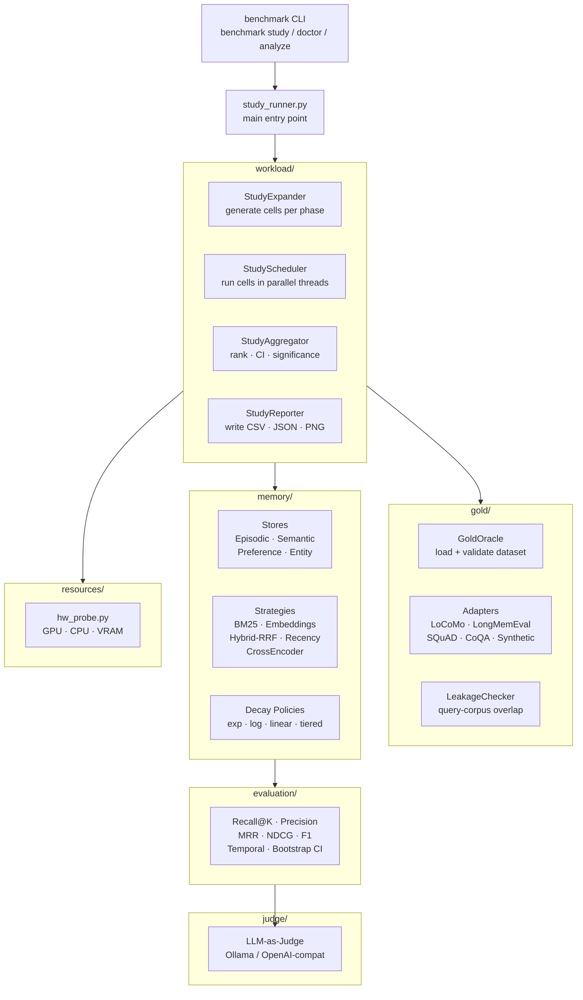
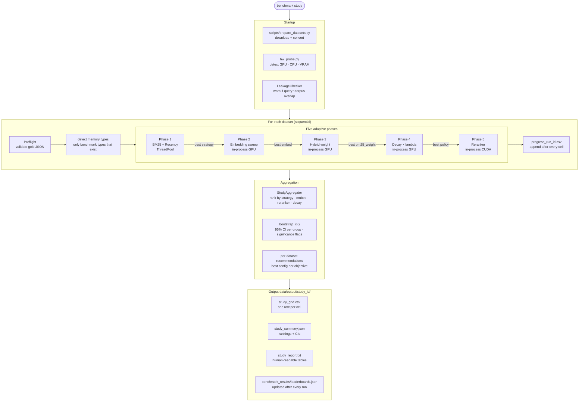
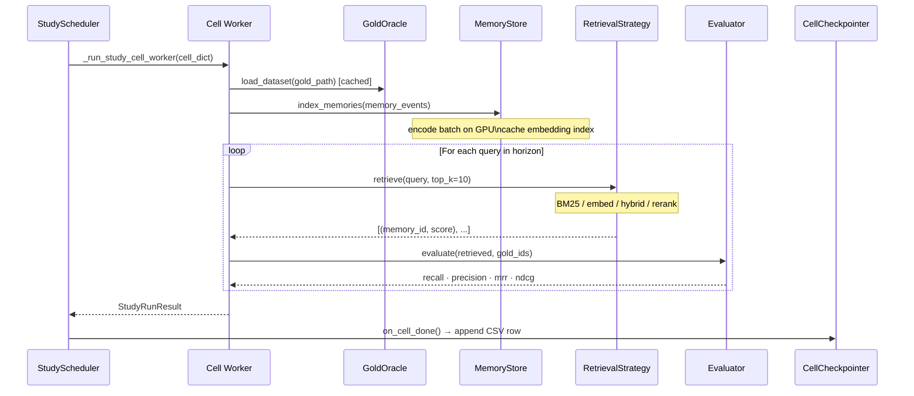
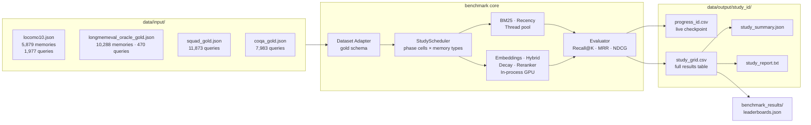
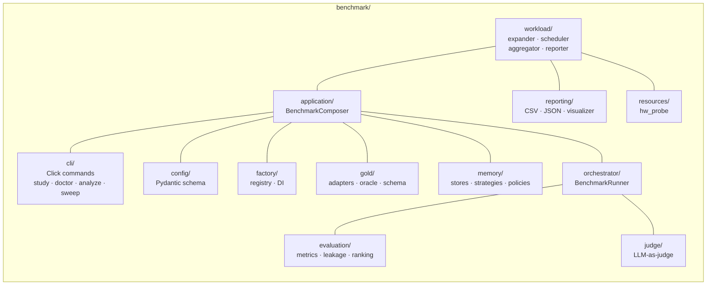

# MemTuner

<p align="center">
  <strong>Adaptive benchmarking and configuration tuning for AI agent memory retrieval systems.</strong><br>
  Sweep every configuration in one command · Get one report with the optimal operating point
</p>

<p align="center">
  <a href="https://github.com/karangehlod/agentic-memory-benchmark/actions/workflows/ci.yml">
    
  </a>
  <a href="https://github.com/karangehlod/agentic-memory-benchmark/actions/workflows/math_tests.yml">
    
  </a>
  
  
  
  
</p>

---

## Overview

MemTuner is an adaptive benchmark for AI agent memory retrieval systems. It systematically evaluates retrieval strategies, embedding models, hybrid BM25/semantic fusion, reranking, temporal decay, and memory types across multiple datasets to identify high-performing configurations and dataset-specific recommendations.

Most memory benchmarks answer: *"Can model X remember fact Y?"*

MemTuner answers: *"Which combination of memory type, retrieval strategy, embedding model, BM25/semantic weight, reranker, and decay rate gives the best recall–precision tradeoff — and how does changing each knob move the needle?"*

**Why this matters:** Production agent memory systems require five independent design decisions: what to store (memory type), how to find it (retrieval strategy), which model to use (embedding), how to rank results (reranker), and when to forget (decay). Without a systematic sweep, developers make guesses. MemTuner provides empirical answers.

### Key design decisions

- **Five-phase adaptive study** — each phase uses the prior winner as seed, so later phases automatically build on the best earlier configuration
- **All embedding and reranker models run directly on GPU** via PyTorch (sentence-transformers) — no HTTP overhead, no Ollama required for retrieval
- **Statistical significance** — 95% bootstrap CIs reported when multiple seeds are run; recency baseline anchors every comparison
- **Early stopping** — Phase 5 (decay sweep) stops testing λ values once performance plateaus, saving up to 40% of cells
- **Per-dataset recommendations** — the best strategy varies significantly by dataset; results are reported per-dataset, not just as a cross-dataset average

---

## Table of Contents

- [Benchmark Design](#benchmark-design)
- [Installation](#installation)
- [Quick Start](#quick-start)
- [Models](#models)
- [Running the Benchmark](#running-the-benchmark)
- [Output](#output)
- [Datasets](#datasets)
- [Mathematical Foundations](#mathematical-foundations)
- [Results](#results)
- [Statistical Analysis](#statistical-analysis)
- [Simulation Figures](#simulation-figures)
- [Architecture](#architecture)
- [Development](#development)
- [Contributing](#contributing)
- [Citation](#citation)
- [License](#license)

---

## Benchmark Design

### Five adaptive phases

Each phase seeds the next from its winner. The BM25 weight found in Phase 3 flows into Phase 4 decay cells; the best embedding from Phase 2 flows into all later phases.

```mermaid
flowchart LR
    DS[(Dataset\nGold JSON)] --> P1

    subgraph P1["Phase 1 — Baselines"]
        direction TB
        B1[BM25]
        R1[Recency]
    end

    subgraph P2["Phase 2 — Embedding Sweep"]
        direction TB
        E1[MiniLM-L6]
        E2[BGE-base ✓]
        E3[BGE-M3]
        E4[Qwen3-0.6B]
        E5[EmbeddingGemma]
    end

    subgraph P3["Phase 3 — Hybrid Weight"]
        direction TB
        H1["bm25w=0.1…1.0\nfine zoom around best"]
    end

    subgraph P4["Phase 4 — Decay × Lambda"]
        direction TB
        D1["exponential × 8λ"]
        D2["logarithmic × 8λ"]
        D3["linear × 8λ"]
        D4["tiered × 8λ"]
    end

    subgraph P5["Phase 5 — Reranker ⚠️ CUDA only"]
        direction TB
        RR1[bge-reranker-base]
        RR2[ms-marco-MiniLM]
        RR3[none baseline]
    end

    OUT[(Reports\nCSV · JSON · PNG)]

    P1 -->|"best strategy\n+ BM25 recall"| P2
    P2 -->|"best embed\n+ backend"| P3
    P3 -->|"best embed\n+ bm25_weight"| P4
    P4 -->|"best embed\n+ decay policy"| P5
    P5 --> OUT
```



> **Hardware note:** Phase 5 (CrossEncoder reranking) requires CUDA (NVIDIA GPU). MPS (Apple Silicon) hangs on `CrossEncoder.predict()`. Phases 1–4 run fully on MPS and CPU.

### Memory types benchmarked

| Type | Stores | Example content |
|------|--------|-----------------|
| **Episodic** | `EpisodicStore` | Conversation turns, events with timestamps |
| **Semantic** | `SemanticStore` | Facts, knowledge, structured information |
| **Preference** | `PreferenceStore` | User preferences, personal context |
| **Entity** | `EntityStore` | Named entities and their attributes |

---

## Installation

**Requirements:** Python 3.11+

```bash
git clone https://github.com/karangehlod/agentic-memory-benchmark.git
cd agentic-memory-benchmark

python -m venv .venv
source .venv/bin/activate          # Linux/macOS
.venv\Scripts\activate             # Windows PowerShell

pip install -e ".[viz]"
cp .env.example .env
```

### GPU support by platform

The benchmark auto-detects the best available GPU backend at startup via `hw_probe.py`.
Batch sizes and worker counts are computed from actual hardware — no manual tuning needed.

| Platform | GPU backend | Detected as | Notes |
|----------|------------|-------------|-------|
| **Windows / Linux — NVIDIA** | CUDA | `device=cuda` | Full support, recommended hardware |
| **macOS — Apple Silicon (M1/M2/M3/M4)** | MPS | `device=mps` | Full support via PyTorch MPS backend |
| **Linux — AMD (ROCm)** | ROCm via CUDA compat | `device=cuda` | Install ROCm build of PyTorch |
| **Any — CPU only** | None | `device=cpu` | Works, ~10–50× slower for embedding phases |

**Windows — CUDA PyTorch (NVIDIA GPU):**
```powershell
# Find your CUDA version: nvidia-smi (look for "CUDA Version: X.Y")
pip uninstall torch torchvision torchaudio -y
pip install torch torchvision torchaudio --index-url https://download.pytorch.org/whl/cu124
# cu124 = CUDA 12.4   cu121 = CUDA 12.1   cu118 = CUDA 11.8

python -c "import torch; print('CUDA:', torch.cuda.is_available(), torch.cuda.get_device_name(0))"
# Expected: CUDA: True  NVIDIA RTX A4000
```

**macOS Apple Silicon — MPS backend:**
```bash
# Standard PyTorch install includes MPS — no extra steps needed
pip install torch torchvision torchaudio
python -c "import torch; print('MPS:', torch.backends.mps.is_available())"
# Expected: MPS: True
```

**Linux — AMD GPU (ROCm):**
```bash
pip install torch torchvision torchaudio --index-url https://download.pytorch.org/whl/rocm5.7
python -c "import torch; print('ROCm CUDA:', torch.cuda.is_available())"
```

---

## Quick Start

### Step 1 — Prepare datasets

All datasets live under `data/input/`. Download the ones you need:

```bash
# Download LongMemEval, SQuAD 2.0, CoQA (LoCoMo is already included)
python scripts/prepare_datasets.py --download --convert
```

After this, `data/input/` should contain:
```
data/input/
├── locomo10.json                    # included in repo
├── longmemeval_oracle_gold.json
├── squad_gold.json
├── coqa_gold.json
└── synthetic_gold.json
```

### Step 2 — Check what your machine can run

```bash
benchmark doctor          # after pip install -e .
# or
python study_runner.py --doctor
```

This prints hardware analysis, which phases are available, and the exact copy-paste command for your machine.

Example on a 16 GB NVIDIA GPU:
```
  ✓  CPU: 24 logical cores
  ✓  RAM: 64.0 GB total
  ✓  GPU: NVIDIA CUDA — RTX A4000 (16384 MB VRAM, 48 SMs)
  ✓  Phases 1–5 — all phases including CrossEncoder reranker

  benchmark study --gold-dataset data/input/locomo10.json --mode full --workers 23
```

### Step 3 — Run

```bash
# Sanity check — BM25 + Recency only, ~45s, no GPU needed
benchmark study --gold-dataset data/input/locomo10.json --mode quick

# Default run — Phases 1–3 (baseline + embeddings + hybrid)
benchmark study --gold-dataset data/input/locomo10.json --mode default

# Full 5-phase study on one dataset
benchmark study --gold-dataset data/input/locomo10.json --mode full

# Full study — all datasets, results merged into one report
benchmark study \
  --gold-dataset data/input/locomo10.json \
                 data/input/longmemeval_oracle_gold.json \
                 data/input/squad_gold.json \
                 data/input/coqa_gold.json \
  --mode full

# With LLM judge for answer-quality scoring
benchmark study \
  --gold-dataset data/input/locomo10.json \
  --mode full \
  --ollama-url http://localhost:11434/v1 \
  --judge-model nemotron-3-nano:4b

# Statistical run — 3 seeds for 95% bootstrap CIs (~3× longer)
benchmark study \
  --gold-dataset data/input/locomo10.json \
  --mode full --seeds 42 123 456
```

All outputs go to `data/output/study_<run_id>/`.

---

## Models

All models download automatically from HuggingFace on first run and are cached locally. **Pre-download recommended** before long runs:

```python
# Save as download_models.py and run once
from sentence_transformers import SentenceTransformer, CrossEncoder

SentenceTransformer("all-MiniLM-L6-v2")                           #   90 MB
SentenceTransformer("BAAI/bge-base-en-v1.5")                      #  210 MB
SentenceTransformer("BAAI/bge-m3")                                # 1,100 MB
SentenceTransformer("Qwen/Qwen3-Embedding-0.6B",
                    trust_remote_code=True)                        # 1,200 MB
SentenceTransformer("Qwen/Qwen3-Embedding-4B",
                    trust_remote_code=True)                        # 7,600 MB  (fits alone on 16GB GPU)

CrossEncoder("cross-encoder/ms-marco-MiniLM-L6-v2")               #   90 MB
CrossEncoder("BAAI/bge-reranker-base")                            #  210 MB
print("All models cached.")
```

**Total download: ~3.5 GB** (one-time; all runs reuse the cache)

### VRAM usage

| Scenario | Models active | VRAM used | A4000 headroom |
|----------|--------------|-----------|----------------|
| Embedding only (bge-m3) | weights + activations | ~1,400 MB | 14.1 GB free |
| Reranker (bge-m3 + bge-reranker) | both resident | ~1,700 MB | 13.8 GB free |
| Embedding + judge (bge-base + nemotron Q4) | both resident | ~3,400 MB | 12.1 GB free |
| Qwen3-4B embedding alone | weights + activations | ~8,000 MB | 7.5 GB free |

Batch sizes are auto-computed from GPU VRAM at startup (`benchmark/resources/hw_probe.py`). CUDA OOM triggers automatic batch-size halving and retry.

---

## Running the Benchmark

### CLI entry point

All benchmark runs go through `benchmark study` (or `python study_runner.py` directly).
The `benchmark` command requires `pip install -e .` with the venv active.

```bash
# Both of these are equivalent:
benchmark study --gold-dataset data/input/locomo10.json --mode quick
python study_runner.py --gold-dataset data/input/locomo10.json --mode quick
```

### Run options

| Flag | Default | Description |
|------|---------|-------------|
| `--gold-dataset PATH [PATH ...]` | required | One or more dataset paths under `data/input/` |
| `--mode` | `default` | `quick` (ph1) · `default` (ph1–3) · `full` (ph1–5) · `custom` |
| `--phases N [N ...]` | from mode | Run specific phases only, e.g. `--phases 4 5` |
| `--workers N` | `cpu_count - 1` | Parallel threads for BM25/recency phases |
| `--seeds N [N ...]` | `42` | Multiple seeds for bootstrap CIs, e.g. `--seeds 42 123 456` |
| `--early-stop-patience N` | `3` | Phase 4 early-stopping patience; `0` disables |
| `--ollama-url URL` | none | Ollama server for LLM judge |
| `--judge-model MODEL` | none | e.g. `nemotron-3-nano:4b` |
| `--workload` | `medium_qpd` | `low_qpd` · `medium_qpd` · `high_qpd` |
| `--memory-types` | auto-detect | `episodic semantic preference entity` |
| `--no-plots` | off | Skip PNG generation (useful on headless servers) |
| `--output-dir PATH` | `data/output` | Output root directory |
| `--merge CSV [CSV ...]` | — | Merge existing grid CSVs into one unified report |
| `--doctor` | — | Print hardware analysis and copy-paste commands |

---

### Running each phase individually

Run phases independently with `--mode custom --phases N`. Each standalone phase uses
sensible defaults for the upstream seed values (best embedding, best bm25_weight, etc.).
Pass `--skip-models` to exclude models that don't fit your VRAM.

```bash
# Phase 1 — BM25 + Recency baselines (~1 min, no GPU)
benchmark study \
  --gold-dataset data/input/locomo10.json \
  --mode custom --phases 1

# Phase 2 — Embedding model sweep (~30–90 min depending on GPU)
benchmark study \
  --gold-dataset data/input/locomo10.json \
  --mode custom --phases 2

# Phase 3 — Hybrid BM25/semantic weight sweep (~60–120 min)
benchmark study \
  --gold-dataset data/input/locomo10.json \
  --mode custom --phases 3

# Phase 4 — Temporal decay sweep (~90–180 min)
benchmark study \
  --gold-dataset data/input/locomo10.json \
  --mode custom --phases 4

# Phase 5 — Reranker comparison (~30–60 min, CUDA required)
# On Apple Silicon / CPU: CrossEncoder cells are automatically skipped
benchmark study \
  --gold-dataset data/input/locomo10.json \
  --mode custom --phases 5

# Phases 1+2 only (baseline + embedding, skip hybrid/decay/reranker)
benchmark study \
  --gold-dataset data/input/locomo10.json \
  --mode custom --phases 1 2
```

---

### Running all datasets one by one

Each dataset is run sequentially; a merged report is produced at the end.

```bash
# All four datasets — full 5-phase study (recommended for publication)
benchmark study \
  --gold-dataset data/input/locomo10.json \
                 data/input/longmemeval_oracle_gold.json \
                 data/input/squad_gold.json \
                 data/input/coqa_gold.json \
  --mode full

# Estimated total time on NVIDIA A4000 (16 GB):
#   locomo10.json           ~3–4 h  (1,977 queries, 5,879 memories)
#   longmemeval_oracle_gold ~2–3 h  (470 queries, 10,288 memories)
#   squad_gold              ~4–6 h  (11,873 queries)
#   coqa_gold               ~3–5 h  (7,983 queries)
#   Total                  ~12–18 h

# LoCoMo only — fastest to iterate
benchmark study \
  --gold-dataset data/input/locomo10.json \
  --mode full

# LoCoMo + LongMemEval (recommended for first publication run)
benchmark study \
  --gold-dataset data/input/locomo10.json \
                 data/input/longmemeval_oracle_gold.json \
  --mode full
```

---

### Running on a CUDA machine

On a machine with an NVIDIA GPU, all 5 phases run including CrossEncoder rerankers.
Run `benchmark doctor` first to get the hardware-tuned command:

```bash
benchmark doctor   # prints recommended workers + any models to skip

# Typical CUDA full run (A4000 16 GB, 24 cores):
benchmark study \
  --gold-dataset data/input/locomo10.json \
                 data/input/longmemeval_oracle_gold.json \
                 data/input/squad_gold.json \
                 data/input/coqa_gold.json \
  --mode full \
  --workers 23 \
  --seeds 42 123 456

# With LLM judge for answer-quality scoring
benchmark study \
  --gold-dataset data/input/locomo10.json \
  --mode full \
  --workers 23 \
  --ollama-url http://localhost:11434/v1 \
  --judge-model nemotron-3-nano:4b
```

---

### Merging results from multiple runs

If you ran phases separately or across machines, merge the grid CSVs into one report:

```bash
benchmark study --merge \
  data/output/study_abc/study_*_grid.csv \
  data/output/study_def/study_*_grid.csv
```

---

## Running on Multiple Machines

Running Phases 1–4 on Mac (MPS) and Phase 5 on a CUDA machine lets you get full results
without needing a GPU for the entire run.

### Per-machine capability

| Phase | Mac Apple Silicon (MPS) | Linux/Windows NVIDIA (CUDA) |
|-------|------------------------|----------------------------|
| 1 — BM25 + Recency | ✅ Full | ✅ Full |
| 2 — Embedding sweep | ✅ Full (embedding only) | ✅ Full |
| 3 — Hybrid sweep | ✅ Full | ✅ Full |
| 4 — Decay sweep | ✅ Full | ✅ Full |
| 5 — Reranker (CrossEncoder) | ⚠️ `none` baseline only | ✅ Full (bge-reranker, ms-marco) |

### Workflow

**Step 1 — Configure each machine once:**
```bash
benchmark doctor --apply
# Writes BENCHMARK_WORKERS and BENCHMARK_SKIP_MODELS to .env
```

**Step 2 — Run full study on CUDA machine (recommended):**
```bash
# All datasets, all phases, statistical run
benchmark study \
  --gold-dataset data/input/locomo10.json \
                 data/input/longmemeval_oracle_gold.json \
                 data/input/squad_gold.json \
                 data/input/coqa_gold.json \
  --mode full \
  --seeds 42 123 456
```

**Step 3 — Or run phases on separate machines and merge:**
```bash
# On Mac: run Phases 1–4 only
benchmark study \
  --gold-dataset data/input/locomo10.json \
  --mode custom --phases 1 2 3 4

# On CUDA machine: run Phase 5 only (reranker needs CUDA)
benchmark study \
  --gold-dataset data/input/locomo10.json \
  --mode custom --phases 5

# Merge both grid CSVs into one report
benchmark study --merge \
  data/output/mac_run/study_*_grid.csv \
  data/output/cuda_run/study_*_grid.csv
```

**Recall@K metrics are platform-independent** — same model weights, same computation.
Only latency numbers differ between MPS and CUDA.

---

## Output

Each run writes to `data/output/study_<run_id>/`:

```
data/
├── input/                              ← datasets (do not modify)
│   ├── locomo10.json
│   ├── longmemeval_oracle_gold.json
│   ├── squad_gold.json
│   ├── coqa_gold.json
│   └── synthetic_gold.json
│
└── output/
    └── study_<run_id>/
        ├── progress_<run_id>.csv       ← LIVE: one row per completed cell (crash-safe)
        ├── study_<ts>_<id>_report.txt  ← ranked text report + per-dataset recommendations
        ├── study_<ts>_<id>_grid.csv    ← flat table, one row per cell (35+ columns)
        └── study_<ts>_<id>_summary.json← machine-readable rankings + bootstrap CIs
```

The `progress_<run_id>.csv` file is written incrementally — one row per cell as it
completes. If a run crashes at cell 50 of 100, the first 50 results are already on disk.

**What each file contains:**
- `progress_*.csv` — live checkpoint: `completed_at`, `study_phase`, `memory_type`, `retrieval_strategy`, `recall_at_k`, `mrr`, `peak_ram_mb`, `success`, …
- `_report.txt` — human-readable tables: strategy ranking, per-dataset breakdown, bootstrap CI significance table (when `--seeds` used)
- `_grid.csv` — one row per cell; import into pandas, Excel, or R for custom analysis
- `_summary.json` — structured JSON with all rankings, CIs, and recommendations

**leaderboards.json** (in `benchmark_results/`) is updated after every run with the latest per-dataset best configurations.

---

## Datasets

| Dataset | Path | Queries | Memories | Notes |
|---------|------|---------|----------|-------|
| **LoCoMo** | `data/input/locomo10.json` | 1,977 | 5,879 | Included. Long-horizon episodic memory, 10 conversations |
| **LongMemEval** | `data/input/longmemeval_oracle_gold.json` | 470 | 10,288 | Download required. Temporal reasoning + knowledge updates |
| **SQuAD 2.0** | `data/input/squad_gold.json` | 11,873 | — | Download required. Reading comprehension |
| **CoQA** | `data/input/coqa_gold.json` | 7,983 | — | Download required. Conversational QA |
| **Synthetic** | `data/input/synthetic_gold.json` | 200 | — | Generated. Controlled experiments with known ground truth |

**Download all datasets:**
```bash
python scripts/prepare_datasets.py --download --convert
```

This downloads from their original sources (Stanford NLP, HuggingFace) and converts to the
gold format. LoCoMo is already included — only the others need downloading (~50 MB total).

> **Leakage note (LoCoMo):** 57.6% of LoCoMo queries overlap the memory corpus verbatim.
> The benchmark warns about this at startup. Results are valid for model selection and
> engineering comparisons, but should not be reported as unbiased recall estimates in papers
> without a clean evaluation split.

---

## Mathematical Foundations

### Decay functions

Four policies implemented in `benchmark/memory/long_term/base_store.py`.
All apply an **archival floor** (0.65) for memories older than 90 days — without it, long-lived gold memories collapse to near-zero and become unretrievable.

| Policy | Formula | Half-life (λ=0.01) |
|--------|---------|-------------------|
| **Exponential** | `f(t) = e^{−λt}` | 69 days |
| **Linear** | `f(t) = max(0, 1 − λt)` | 50 days |
| **Logarithmic** | `f(t) = 1 / (1 + λt)` | 100 days |
| **Tiered** | `1 (t≤7);  e^{−λ(t−7)} (7<t<90);  1 (t≥90)` | — |

With archival floor: `f(t) = max(0.65, f_raw(t))  for t ≥ 90`

Lambda sweep: `{0.001, 0.005, 0.01, 0.02, 0.05, 0.10}`
Corresponding exponential half-lives: 693, 139, 69, 35, 14, 7 days

### Composite score

```
C = recall_gate × (0.40 × Recall@K  +  0.25 × Precision@K  +  0.20 × MRR  +  0.15 × TemporalAccuracy)

recall_gate = 0  if Recall@K < 0.01
            = 1  otherwise
```

Weights: Recall (40%) is the primary objective. Precision (25%) penalises noisy results. MRR (20%) rewards correct top-1. Temporal accuracy (15%) rewards correct time-window retrieval (zero-weighted when not applicable).

### Hybrid strategy — Reciprocal Rank Fusion

```
score_RRF(d) = w_BM25 / (60 + rank_BM25(d))  +  w_embed / (60 + rank_embed(d))
```

`k=60` (Cormack et al. 2009 standard constant). `w_BM25` swept over `{0.2, 0.5, 0.8}`. Documents in both ranked lists receive additive contributions — the key advantage over score-based fusion.

### Bootstrap confidence intervals

```
For each group g with n observations:
  1. Resample with replacement B=1000 times → compute mean each time
  2. 95% CI = (2.5th percentile, 97.5th percentile) of bootstrap means
  3. Two groups are significantly different if their CIs do not overlap
```

Standard non-parametric percentile bootstrap (Sakai 2006, Voorhees 2001).

### Early stopping (Phase 5)

```
For each policy ∈ {exponential, logarithmic, linear}:
  for λ in {0.001, 0.005, 0.01, 0.02, 0.05, 0.10}:
    Δ = composite_score(λ) − best_composite_so_far
    if Δ < min_delta (0.005): increment no_improve_counter
    else: reset counter, update best
    if counter ≥ patience (3): skip remaining λ values, break
```

Typically saves 30–50% of Phase 5 cells when optimal λ is found at 0.01–0.02.

---

## Results

### LoCoMo (10 conversations, 1,977 queries, 5,879 memories)

> Measured on Apple Silicon MPS. Phase 5 CrossEncoder cells require CUDA and were skipped on this machine.

#### Phase 1 — Baselines

| Strategy | Recall@10 | MRR | Notes |
|----------|-----------|-----|-------|
| **BM25** | **53.1%** | **0.396** | Episodic memory |
| Recency | 7.5% | 0.024 | Lower bound — K most recent |

#### Phase 2 — Embedding models (episodic, direct GPU)

| Model | Params | Recall@10 | Latency P50 | vs BM25 |
|-------|--------|-----------|-------------|---------|
| all-MiniLM-L6-v2 | 22M | 57.7% | ~7 ms | +4.6pp |
| Qwen3-Embedding-0.6B | 0.6B | 59.0% | ~10 ms | +5.9pp |
| google/embeddinggemma-300m | 300M | 56.6% | ~11 ms | +3.5pp |
| BAAI/bge-m3 | 570M | 52.7% | ~10 ms | −0.4pp |
| **BAAI/bge-base-en-v1.5** | **110M** | **65.7%** | **~9 ms** | **+12.6pp** ✓ winner |

#### Phase 3 — Hybrid weight sweep (episodic, bge-base-en-v1.5)

| BM25 Weight | Recall@10 | MRR | Notes |
|-------------|-----------|-----|-------|
| 0.0 (pure semantic) | 65.7% | 0.293 | Phase 2 baseline |
| 0.2 | 69.5% | 0.396 | |
| **0.35** | **71.5%** | **0.429** | ✓ winner |
| 0.4 | 71.0% | 0.434 | |
| 0.5 | 67.8% | 0.431 | |
| 1.0 (pure BM25) | 53.1% | 0.299 | Phase 1 baseline |

#### Phase 4 — Temporal decay sweep (episodic, hybrid bge-base bm25w=0.35)

*Note: Phase 4 seeding bug fixed — prior runs incorrectly used bm25_weight=0.5 instead of 0.35. Re-run required for corrected numbers.*

| Policy | Best λ | Recall@10 | MRR | vs no-decay |
|--------|--------|-----------|-----|-------------|
| No decay | — | ~71.5% | ~0.429 | baseline |
| Tiered | ~0.0017 | ~67.9% | **~0.493** | −3.6pp recall, **+6.4pp MRR** |
| Exponential | — | ~67.8% | ~0.489 | No improvement in recall |
| Logarithmic | — | ~67.7% | ~0.487 | No improvement in recall |

Decay trades recall breadth for ranking quality. Tiered policy improves MRR significantly (better top-1 ranking) while slightly reducing raw recall.

#### Two operating points

| Objective | Configuration | Recall@10 | MRR |
|-----------|--------------|-----------|-----|
| **Max recall** | BGE-base + hybrid + bm25w=0.35 + no decay | **71.5%** | 0.429 |
| **Max ranking quality** | BGE-base + hybrid + bm25w=0.35 + tiered decay λ≈0.0017 | ~67.9% | **~0.493** |

> Results vary by dataset. Always check the per-dataset section of the generated report — the best strategy and BM25 weight differ significantly across LoCoMo, LongMemEval, SQuAD, and CoQA.

---

## Statistical Analysis

### Metrics reference

| Metric | Formula | What it measures |
|--------|---------|-----------------|
| **Recall@K** | `\|retrieved ∩ gold\| / \|gold\|` | Coverage of gold evidence |
| **Precision@K** | `\|retrieved ∩ gold\| / K` | Fraction of results that are relevant |
| **F1** | `2PR / (P+R)` | Harmonic mean |
| **MRR** | `1 / rank_of_first_relevant` | Is the top result correct? |
| **NDCG@K** | `DCG / IDCG` (log₂) | Position-discounted ranking quality |
| **Precision@1** | Precision at rank 1 | Critical for single-result systems |
| **Contamination** | FP / total retrieved | Noise ratio |
| **Composite** | `0.40R + 0.25P + 0.20MRR + 0.15T` | Single ranking score |
| **Latency P50/P90/P99** | ms | Typical and tail query latency |

Evaluation K defaults to 10. Override: `BENCHMARK_RECALL_K=5 python study_runner.py ...`

### Statistical significance

Run with multiple seeds to get bootstrap CIs:

```bash
python study_runner.py --mode full --seeds 42 123 456
```

Output:
```
  STATISTICAL SIGNIFICANCE (95% Bootstrap CI, Recall@K):
    Strategy               Mean    95% CI              Std     N  Sig
    ────────────────────────────────────────────────────────────────
    embeddings             0.6657  [0.6527, 0.6780]  0.0312  30  ★
    bm25                   0.5258  [0.5138, 0.5341]  0.0218  30  ★
    recency                0.1805  [0.1663, 0.1943]  0.0431  30
    ★ = CIs do not overlap (p < 0.05 approx.)
```

---

## LLM Judge Configuration

The LLM judge scores answer quality (not just retrieval ID matching) after retrieval.
It works with **any OpenAI-compatible endpoint** — Ollama, OpenAI API, Anthropic (via proxy), or local vLLM.

```bash
# Option 1: Local Ollama (recommended for reproducibility)
ollama pull nemotron-3-nano    # ~2.7 GB Q4
python study_runner.py --mode full \
  --ollama-url http://localhost:11434/v1 \
  --judge-model nemotron-3-nano:4b

# Option 2: OpenAI API
BENCHMARK_JUDGE_BASE_URL=https://api.openai.com/v1
BENCHMARK_JUDGE_API_KEY=sk-your-key
BENCHMARK_JUDGE_MODEL=gpt-4o-mini
python study_runner.py --mode full

# Option 3: Any OpenAI-compatible server (vLLM, LM Studio, etc.)
BENCHMARK_JUDGE_BASE_URL=http://localhost:8000/v1
BENCHMARK_JUDGE_MODEL=your-model-name
python study_runner.py --mode full
```

When enabled, each query produces an additional `llm_judge_score` (0–1) alongside `recall_at_k`.
This closes the gap between "did we find the right memory IDs?" and "did those memories produce the right answer?"

---

## Simulation Figures

Generate publication-quality mathematical figures for papers:

```bash
python -m benchmark.reporting.simulation_plots --output docs/figures/
```

| Figure | Content |
|--------|---------|
| `fig1_decay_curves.png` | All 4 decay policies × 5 λ values over 300 days |
| `fig2_composite_sensitivity.png` | One-at-a-time weight sensitivity + recall vs composite |
| `fig3_hybrid_fusion.png` | RRF contribution curves + hybrid score vs BM25 weight |
| `fig4_lambda_phase_space.png` | 2D (λ, t) phase space contour plot (MATLAB-equivalent) |

---

## Architecture

### Module layout



---

### Execution flow



---

### Single-cell execution (inside each phase)



---

### Data flow — input to output



---

### Package structure



---

### Performance optimisations

| Optimisation | Where | Effect |
|---|---|---|
| Incremental embedding index | `EmbeddingsStrategy` | Each memory encoded once per cell, not per day |
| Query prewarm | `EmbeddingsStrategy` | All queries batch-encoded in one GPU call |
| Two-stage reranking | `LLMRerankStrategy` | BM25 top-100 → CrossEncoder; not full corpus |
| Model LRU cache | `_INDEX_CACHE` (16 slots) | Same corpus+model → skip encode (Phase 3 reuses Phase 2) |
| CrossEncoder cache | `_CE_MODEL_CACHE` | Reranker loaded once, reused across Phase 5 cells |
| BM25 corpus cache | `_BM25_CORPUS_CACHE` | Tokenize corpus once per unique corpus |
| Dataset parse cache | `GoldOracle` | 2.7 MB JSON parsed once per phase, shared across cells |
| Thread pool (BM25/Recency) | `StudyScheduler` | Up to `cpu_count-1` true-parallel workers via threads |
| Hard worker cap | `StudyScheduler` | `min(requested, cpu_count-1, n_parallel_cells)` — no idle threads |
| OMP/MKL thread cap | startup env | GPU kernel threads not starved by numpy/blas threads |

---

## Development

### Setup

```bash
pip install -e ".[dev]"
pre-commit install
```

### Running tests

```bash
# All tests
python -m pytest tests/ -q

# Unit tests only (fast, no I/O)
python -m pytest tests/ -m unit -q

# Integration tests
python -m pytest tests/ -m integration -q

# Math correctness tests specifically
python -m pytest tests/unit/test_math_correctness.py -v
```

The math test suite (`tests/unit/test_math_correctness.py`) covers:
- All four decay formula implementations with boundary conditions
- Composite score formula, recall gate, and weight correctness
- Recency strategy ordering and score properties
- Bootstrap CI mean fidelity, CI containment, and width vs variance
- RRF fusion with k=60, pure-BM25 and pure-embed degenerate cases

### Adding a new retrieval strategy

1. Create `benchmark/memory/strategies/my_strategy.py` implementing `RetrievalStrategy`
2. Register in `benchmark/factory/bootstrap.py`
3. Add to `EMBEDDING_MODELS_LOCAL` or `EMBEDDING_MODELS_OLLAMA` in `study_matrix.py`
4. Add math tests in `tests/unit/test_math_correctness.py`

### Adding a new dataset adapter

1. Create `benchmark/gold/adapters/my_adapter.py` implementing `DatasetAdapter`
2. Ensure gold memory IDs match between `memory_events` and `queries.expected.memory_ids`
3. Ensure `query.day >= injection_day(gold_memory)` for all queries (temporal validity)

---

## Contributing

Contributions are welcome. See [CONTRIBUTING.md](CONTRIBUTING.md) for the full guide — it covers dev setup, test commands, how to add a new dataset adapter or retrieval strategy, and the PR checklist.

Quick start:
```bash
git clone https://github.com/karangehlod/agentic-memory-benchmark.git
cd agentic-memory-benchmark
pip install -e ".[dev]"
python -m pytest tests/unit/test_math_correctness.py -v   # math tests must pass
```

Please open an issue (or GitHub Discussion for questions) before starting large changes.

---

## Citation

If you use this benchmark in your research, please cite:

```bibtex
@software{agentic_memory_benchmark_2026,
  title   = {Agentic Memory Benchmark: A Systematic Framework for
             Evaluating AI Agent Memory Retrieval},
  author  = {Gehlod, Karan},
  year    = {2026},
  url     = {https://github.com/karangehlod/agentic-memory-benchmark},
  note    = {Five-phase adaptive sweep: BM25 baseline, embedding model
             comparison, hybrid weight sweep, reranker comparison,
             decay policy sweep with early stopping}
}
```

---

## Troubleshooting

**Check which GPU backend was detected:**
```bash
BENCHMARK_HW_DEBUG=1 python -c "import benchmark.resources.hw_probe"
# Shows: device=cuda|mps|cpu  VRAM=...MB  batch(384)=...  workers=...
```

**`device=cpu` on Windows/Linux with NVIDIA GPU**
```powershell
pip uninstall torch torchvision torchaudio -y
pip install torch torchvision torchaudio --index-url https://download.pytorch.org/whl/cu124
python -c "import torch; print(torch.cuda.is_available())"  # must print True
```

**`device=cpu` on macOS Apple Silicon**
```bash
pip install --upgrade torch  # MPS included in standard PyTorch ≥ 2.0
python -c "import torch; print(torch.backends.mps.is_available())"  # must print True
```

**`CUDA out of memory` during encoding**
Batch size auto-halves and retries. If it keeps failing:
```bash
BENCHMARK_RERANKER_BATCH_SIZE=64 python study_runner.py ...
```

**`squad_gold.json` all cells fail / `[skip] cannot load dataset`**
The file is empty from a failed prior conversion. Delete and re-run:
```powershell
del data\squad_gold.json
python study_runner.py --mode full
```

**Models still showing as `ollama_embeddings` after code update**
Stale `.pyc` bytecode. Cleared automatically on startup. Force-clear manually:
```powershell
Get-ChildItem -Recurse -Filter "*.pyc" benchmark/ | Remove-Item
```

**Phase 5 ran all 57 cells instead of stopping early**
All λ values genuinely improved, or improvement was above `min_delta`. Check the per-phase output for `[early-stop]` vs `[full-sweep]` messages. Use `--early-stop-patience 2` for more aggressive stopping.

**`sentence-transformers` crash (SIGSEGV / exit 139)**
On macOS ARM + Python 3.13, spawned subprocesses crash on CUDA init. Fixed: embedding cells run in-process. BM25/recency cells run in the thread pool unaffected.

**Phase 5 CrossEncoder rerankers skipped / `require CUDA` warning**
CrossEncoder `predict()` hangs indefinitely on MPS (Apple Silicon) and CPU on macOS ARM.
This is a known PyTorch/sentence-transformers limitation. Phase 5 automatically removes
`bge-reranker-base` and `ms-marco-MiniLM-L6-v2` on non-CUDA machines and runs only the
`none` reranker baseline. Run Phase 5 on a machine with an NVIDIA GPU to get reranker results.

**Workers showing higher than expected**
Default is `cpu_count - 1` (all cores except one for the OS). The banner shows
`N / M cores` where N is the effective count after capping. Passing `--workers 20`
on a 10-core machine silently caps to 9.

---

## License

MIT — see [LICENSE](LICENSE).
